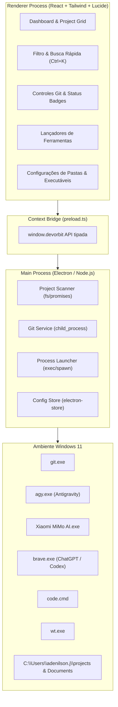

# DevOrbit — Developer Workspace Hub & AI Launcher

**Data:** 2026-09-10  
**Status:** Especificação Aprovada  
**Autor:** Antigravity & Adenilson  

---

## 1. Visão Geral e Objetivos

O **DevOrbit** é um aplicativo desktop moderno desenvolvido para eliminar o atrito de navegação, sincronização e troca de ferramentas no fluxo diário de desenvolvimento. 

Atualmente, gerenciar múltiplos repositórios com diversas ferramentas de inteligência artificial (duas contas do ChatGPT Plus no Brave para Codex, Antigravity CLI para Gemini, Xiaomi MiMo AI, VS Code e Windows Terminal) exige navegação manual por pastas do Windows Explorer, execução manual de comandos Git e abertura fragmentada de ferramentas.

O DevOrbit centraliza tudo em uma interface visual de alta produtividade (estilo Linear/Raycast), fornecendo:
- **Visão consolidada de projetos** em pastas configuráveis (`projects`, `Documents`, etc.).
- **Diagnóstico e sincronização Git em tempo real** (status da branch, commits pendentes e botão de 1 clique para `git pull`).
- **Lançador rápido de ferramentas e IAs** (Antigravity, MiMo AI, Brave/ChatGPT, VS Code, Terminal).
- **Gerador de contexto para LLMs**: cópia com 1 clique do resumo técnico do projeto para colar em qualquer chat de IA.

---

## 2. Arquitetura do Sistema



### 2.1 Stack Tecnológica
- **Plataforma:** Electron 34+
- **Frontend / UI:** React 19 + TypeScript + Vite + Tailwind CSS v4 + Lucide React
- **Animações / UX:** Framer Motion / Tailwind transitions
- **Persistência Local:** Configurações em JSON (`electron-store` ou arquivo de configuração local simples)
- **Integração de Sistema:** `child_process.spawn` e `execFile` com suporte a caminhos Windows com espaços e permissões seguras.

---

## 3. Especificação das Funcionalidades

### 3.1 Varredura de Projetos (Project Scanner)
- **Diretórios Raiz Padrão**:
  - `C:\Users\adenilson.j\projects`
  - `C:\Users\adenilson.j\Documents`
  - Suporte a adicionar/remover pastas personalizadas a qualquer momento.
- **Detecção de Tipo de Projeto & Tecnologias**:
  - `package.json` -> Node.js / React / Next / Vite
  - `pubspec.yaml` -> Flutter / Dart
  - `pom.xml` / `build.gradle` -> Java
  - `requirements.txt` / `pyproject.toml` -> Python
  - `Cargo.toml` -> Rust
  - `.git` presente -> Repositório Versionado

### 3.2 Git Service & Sincronização
Para cada repositório detectado, o DevOrbit executa em background:
- `git status --porcelain -b` para obter o nome da branch atual, quantidade de commits adiante/atrás da origin e alterações locais não commitadas.
- **Badges Visuais**:
  - 🟢 **Sincronizado**: Branch limpa e alinhada com a origin remota.
  - 🔵 **Atualizações Disponíveis**: Repositório possui commits no GitHub (`behind X`). Exibe botão de destaque **"Sync Git"**.
  - 🟡 **Alterações Locais**: Arquivos modificados ou não rastreados (`modified X`).
  - ⚪ **Sem Git**: Diretório simples.
- **Ação "Sync Git"**:
  - Executa `git pull` na pasta do projeto.
  - Notifica sucesso com animação ou alerta caso existam conflitos de merge.

### 3.3 Lançador de Ferramentas e Assistentes IA

| Ferramenta | Caminho / Comando Detectado | Ação ao Clicar |
| :--- | :--- | :--- |
| **Antigravity** | `C:\Users\adenilson.j\AppData\Local\agy\agy.exe` | Abre o terminal interativo do Antigravity CLI com o diretório do projeto como workspace. |
| **MiMo AI** | `C:\Users\adenilson.j\AppData\Local\Programs\Xiaomi MiMo AI\Xiaomi MiMo AI.exe` | Executa o aplicativo Xiaomi MiMo AI. |
| **Brave (ChatGPT / Codex)** | `C:\Program Files\BraveSoftware\Brave-Browser\Application\brave.exe` | Abre o Brave diretamente no ChatGPT/Codex com atalhos para alternar entre Conta 1 e Conta 2. |
| **VS Code** | `code.cmd` | Executa `code "<caminho_do_projeto>"`. |
| **Windows Terminal** | `wt.exe` | Executa `wt.exe -d "<caminho_do_projeto>"`. |
| **Copiar Contexto** | Clipboard API do Electron | Gera e copia um resumo técnico do projeto formatado para IA (Stack, Branch, Arquivos alterados). |

### 3.4 Design da Interface (UI/UX)
- **Tema:** Dark mode profissional (`#0a0d14` de fundo, cards em `#131823` com bordas sutis `#1e293b`).
- **Header Customizado:** Barra de título semitransparente moderna (frameless com botões nativos de minimizar/fechar estilizados).
- **Busca Global (`Ctrl + K` / `Ctrl + F`):** Filtragem instantânea por nome, tecnologia ou status do git.
- **Indicador de Conta ChatGPT:** Chave seletora no topo indicando visualmente "Conta 1 (Principal)" ou "Conta 2 (Backup/Alternativa)".

---

## 4. Estrutura de Arquivos do Projeto

```
gallant-darwin/
├── src/
│   ├── main/
│   │   ├── index.ts             # Entrypoint do processo principal Electron
│   │   ├── scanner.ts           # Varredura e detecção de projetos
│   │   ├── git.ts               # Execução de comandos Git e parse de status
│   │   ├── launcher.ts          # Inicialização de ferramentas (agy, mimo, brave, code, wt)
│   │   └── config.ts            # Gerenciamento de pastas e preferências
│   ├── preload/
│   │   └── index.ts             # ContextBridge seguro e tipado
│   └── renderer/
│       ├── index.html
│       ├── src/
│       │   ├── main.tsx
│       │   ├── App.tsx          # Componente raiz do Dashboard
│       │   ├── components/
│       │   │   ├── Header.tsx   # Barra superior, busca e alternador de contas
│       │   │   ├── ProjectCard.tsx # Card de projeto com badges e botões de ação
│       │   │   ├── ProjectGrid.tsx # Lista/Grid de projetos
│       │   │   ├── GitSyncModal.tsx # Feedback detalhado de sync
│       │   │   └── SettingsModal.tsx # Ajuste de caminhos e executáveis
│       │   ├── types.ts         # Tipos compartilhados
│       │   └── index.css        # Tailwind e estilos customizados
├── electron-builder.json        # Configuração para empacotar executável Windows
├── package.json
├── tsconfig.json
├── vite.config.ts
└── docs/
    └── superpowers/
        └── specs/
            └── 2026-09-10-devorbit-launcher-design.md
```

---

## 5. Plano de Verificação e Qualidade

1. **Varredura e Detecção**:
   - Validar que projetos em `C:\Users\adenilson.j\projects` (ex: `sgad-app`, `JogoBaseball`, `java`) são listados instantaneamente com seus status Git reais.
2. **Execução de Ferramentas**:
   - Testar o clique de abertura para Antigravity (`agy.exe`), Xiaomi MiMo AI, VS Code, Windows Terminal e Brave.
3. **Sincronização Git**:
   - Testar a ação de "Sync Git" em um repositório para certificar que `git pull` é executado com sucesso e a interface é atualizada em tempo real.
4. **Cópia de Contexto**:
   - Validar que o botão de copiar gera um texto limpo e rico para ser colado no ChatGPT.
